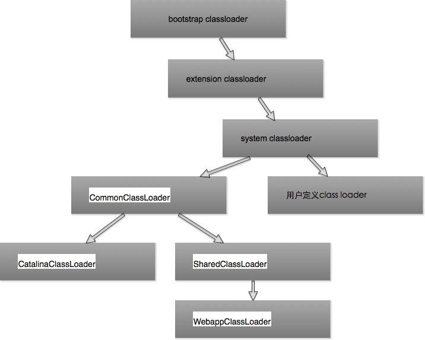

## 类加载器

---


java允许通过编码方式间接对Class进行操作，当一个class文件被类加载器装载后，在JVM就会形成一份描述Class结构的元数据，通过这些元数据可以获知Class的结构信息：比如构造器、属性和方法。同时也允许用户根据这些元信息对象间接调用Class对象的功能，即“反射”机制。

**类装载器(ClassLoader)是寻找字节码文件并加载到jvm中。步骤分为三步：**

1）装载：查找和导入Class文件

2）链接：执行校验、准备和解析

```
  校验：检查载入的Class文件数据的正确性
  准备：给变量分配存储空间
  解析：将符号引用转成直接引用
```
      
3）初始化：给类的静态变量或静态代码块执行初始化工作


类的装载器有三个：根装载器（用C++编写），负责装载JRE的核心类库。ExtClassLoader扩展类加载器，负责加载ext目录下的jar包。AppClassLoader系统类装载器，负责装载Classpath路径下的类包。这三个类装载器存在父子层级关系，根装载器是ExtClassLoader的父装载器，ExtClassLoader是AppClassLoader的父装载器。一般来说，Java 应用的类都是由AppClassLoader来完成加载的。可以通过 ClassLoader.getSystemClassLoader() 来获取它。一般来说，开发人员编写的类加载器的父类加载器是 应用类加载器  Application ClassLoader  

除了系统提供的类加载器以外，开发人员可以通过继承 java.lang.ClassLoader 类的方式实现自己的类加载器，以满足一些特殊的需求。

除了根类加载器之外，所有的类加载器都有一个父类加载器。可以通过 getParent()方法得到。**不同的类加载器为相同名字的类创建了额外的名称空间，所以相同名称的类才可以并存在 Java 虚拟机中，只需要用不同的类加载器来加载它们即可。**不同类加载器加载的类之间是不兼容的（相当于两个不同的类型），这就相当于在 Java 虚拟机内部创建了一个个相互隔离的 Java 类空间。这种技术在许多框架中都被用到，如OSGI等。

jvm启动时，会启动jre/rt.jar里的类加载器：bootstrap classloader，用来加载java核心api；然后启动扩展类加载器ExtClassLoader加载扩展类，并加载用户程序加载器AppClassLoader，并指定ExtClassLoader为他的父类；




CommonClassLoader、CatalinaClassLoader和SharedClassLoader与具体部署的Web应用无关，而WebappClassLoader则对应Web应用，每个Web应用都会有独立的类加载器，从而实现类的隔离。当类被加载时，会先检查在内存中是否已经被加载，如果是，则不再加载，如果没有，再由AppClassLoader来加载，先从jar包里找，没有再从classpath里找；如果自定义loader类，就会存在命名空间的情况，不同的加载器加载同一个类时，产生的实例其实是不同的。

**实例 ：**

我们可以考虑这样一种情况，假设我们自定义了一个ClientDefClassLoader，我们使用这个自定义的ClassLoader加载java.lang.String，那么这里String是否会被这个ClassLoader加载呢？事实上java.lang.String这个类并不是被这个ClientDefClassLoader加载，而是由bootstrap classloader进行加载，为什么会这样？实际上这就是双亲委托模式的原因，因为在任何一个自定义ClassLoader加载一个类之前，它都会先委托它的父ClassLoader进行加载（递归模式，向上寻找），只有当父亲ClassLoader无法加载成功后，才会由自己加载，在上面这个例子里，因为java.lang.String是属于java核心API的一个类，所以当使用ClientDefClassLoader加载它的时候，该ClassLoader会先委托它的父ClassLoader进行加载，上面讲过，当ClassLoader的parent为null时，ClassLoader就是bootstrap classloader，所以在ClassLoader的最顶层就是bootstrap classloader，因此最终委托到bootstrap classloader的时候，bootstrap classloader就会返回String的Class。 

**双亲委托模式的优势：**

a）避免重复加载，当父类装载器已经加载，则子类装载器没有必要再加载一次

b）安全因素。使用自定义的String来动态替代java核心api中定义类型，这样会存在非常大的安全隐患，而双亲委托的方式，就可以避免这种情况，因为String已经在启动时被加载，所以用户自定义类是无法加载一个自定义的ClassLoader


ClassLoader类

```
protected synchronized Class<?> loadClass(String name, boolean resolve)
 throws ClassNotFoundException
    {
 // First, check if the class has already been loaded
 Class c = findLoadedClass(name);
 if (c == null) {
     try {
  if (parent != null) {
      // 父类装载器加载，false表示加载的类不会初始化
      c = parent.loadClass(name, false);
  } else {
     // 根类装载器加载
      c = findBootstrapClass0(name);
  }
     } catch (ClassNotFoundException e) {
         // If still not found, then invoke findClass in order
         // to find the class.
         c = findClass(name);
     }
 }
 if (resolve) {
     resolveClass(c);
 }
 return c;
    }
```

```
private Class findBootstrapClass0(String name)
 throws ClassNotFoundException
    {
 check();
 if (!checkName(name))
     throw new ClassNotFoundException(name);
 return findBootstrapClass(name);
    }
    
```
check()方法来判断类装载器是否已经初始化；checkName(name)判断name是否合法（不为空&&合法的二进制名字），最后调用findBootstrapClass(name)

```
private native Class findBootstrapClass(String name)
 throws ClassNotFoundException;
```

findBootstrapClass方法是一个native方法，这是我们的root loader，这个载入方法并非是由JAVA所写，而是C++写的，它最终调用JVM中的原生findBootstrapClass方法来完成类的加载。 

**完整的加载class步骤：**

1.检测此Class是否载入过（即在cache中是否有此Class），如果有到8，如果没有到2

2.如果parent classloader不存在（没有parent，那parent一定是bootstrap classloader了），到4

3.请求parent classloader载入，如果成功到8，不成功到5

4.请求jvm从bootstrap classloader中载入，如果成功到8

5.寻找Class文件（从与此classloader相关的类路径中寻找）。如果找不到则到7

6.从文件中载入Class，到8

7.抛出ClassNotFoundException

8.返回Class


**类的完整标识是（classLoader，package，className）**


**Class类中有个静态方法forName，这个方法和ClassLoader中的loadClass方法的目的一样，都是用来加载class的，但是两者在作用上却有所区别？？？**

Class<?> loadClass(String name) 

Class<?> loadClass(String name, boolean resolve) 

我们看到上面两个方法声明，第二个方法的第二个参数用于设置加载类的时候是否链接该类（上文中装载类文件的第二步），true链接，否则就不链接。Class类的forName方法则相反，使用forName加载时会将Class进行解析和初始化。

例如：JDBC DRIVER的加载，我们在加载JDBC驱动的时候都是使用的forName而非是ClassLoader的loadClass方法呢？我们知道，JDBC驱动是通过DriverManager，必须在DriverManager中注册，如果驱动类没有被初始化，则不能注册到DriverManager中，因此必须使用forName而不是用LoadClass。 


